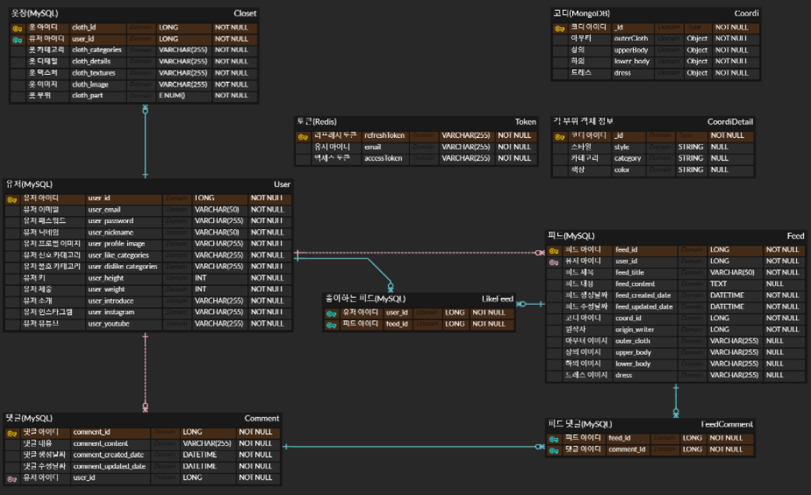
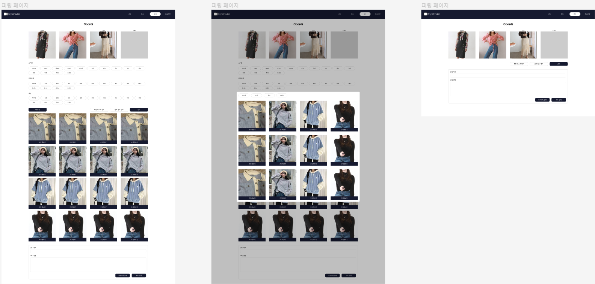
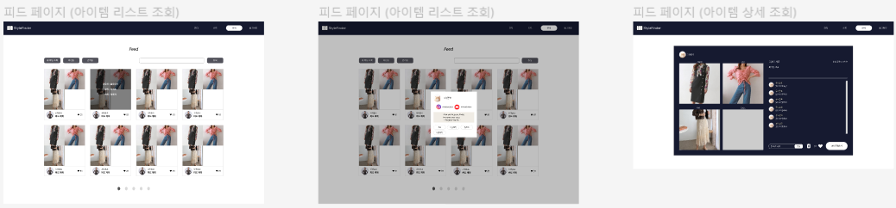
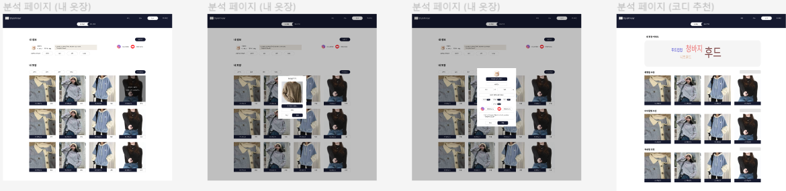

# Style Finder

## 서비스 소개

🌟 "Style Finder"는 개인의 취향과 체형, 최신 패션 트렌드를 고려하여 맞춤형 의류 스타일을 추천해주는 온라인 플랫폼입니다. 사용자가 입력하는 기본 정보와 선호도를 바탕으로, AI 기반 알고리즘이 최적의 의상 조합을 제안함으로써, 매일 아침 '오늘 뭐 입지?'의 고민에서 벗어날 수 있도록 돕습니다.

🎨 핵심 기능

1. 개인별 맞춤 스타일 추천
   선호하는 색상 및 스타일 등을 고려하여 개인에게 어울리는 의류를 추천합니다.

2. 패션 트렌드 분석
   최신 패션 트렌드 데이터를 분석하여, 사용자가 패션에 뒤처지지 않도록 도와줍니다.

3. 커뮤니티 피드
   사용자들이 자신의 스타일을 공유하고, 다른 사용자들의 스타일을 참고할 수 있는 소셜 피드 기능을 제공합니다.

## 개발 환경

### Front-end

- Visual Studio Code
- React 18.2.0
- Node.js 20.10.0
- TypeScript
- Tailwind CSS

### Back-end

- IntelliJ
- SpringBoot 3.2.1
- spring-boot-jpa
- spring security 6.1.3
- OpenJDK 17
- MySQL 8.3.0
- MongoDB 7.0.7
- Redis

### AI

- PyCharm
- MobaXterm
- python 3.10.0
- FastAPI 0.110.0
- uvicorn 0.29.0
- Pytorch 2.2.1

### Data

- VSCode
- MobaXterm
- python 3.8.10
- java 11.0.22
- FastAPI 0.110.0
- uvicorn 0.29.0
- hadoop 3.3.6
- pyspark 3.5.1

### Infra

- MobaXterm
- Docker
- Jenkins 2.426.2
- AWS EC2
- AWS S3
- Server 20.04.6 LTS (GNU/Linux 5.15.0-1051-aws x86_64)
- Nginx 1.24.0

### 협업 툴

- Git
- Jira
- Notion
- Mattermost
- Figma

## 기술 특이점

### 1. 고성능 데이터 처리 아키텍처

빅데이터 처리: Hadoop과 Spark를 이용해 대규모 패션 관련 데이터를 효과적으로 처리하고 분석합니다. 이를 통해 사용자와 패션 아이템 간의 복잡한 관계를 파악할 수 있습니다.

### 2. 사용자 경험 중심의 프론트엔드 설계

모던 인터페이스: React와 Tailwind CSS를 활용하여 사용자 친화적이고 직관적인 인터페이스를 설계합니다. 사용의 용이성과 함께 시각적 매력을 극대화하여 사용자 경험을 향상시킵니다.
반응형 웹 디자인: 다양한 디바이스와 화면 크기에 맞춰 유연하게 대응하는 반응형 웹 디자인을 적용하여, 어떤 환경에서도 일관된 사용자 경험을 제공합니다.

### 3. 안정성과 보안을 고려한 백엔드 구축

SpringBoot와 Spring Security: SpringBoot를 기반으로 RESTful API를 구축하고, Spring Security를 통해 사용자 데이터와 시스템의 보안을 강화합니다. JWT 기반의 인증과 권한 부여 방식을 적용하여 안전한 서비스 환경을 조성합니다.
최적화된 세션 관리: Redis를 사용하여 세션 관리를 최적화합니다. 이는 사이트의 로딩 시간을 단축시키고, 사용자의 서비스 이용 경험을 개선하는 데 기여합니다.

### 4. 지속적인 통합 및 배포 환경

Docker와 Jenkins: Docker를 사용하여 개발 환경의 일관성을 보장하고, Jenkins를 통해 자동화된 지속적 통합(CI) 및 지속적 배포(CD) 파이프라인을 구축합니다. 이는 개발 효율성을 향상시키고, 신속한 업데이트와 안정적인 서비스 운영을 가능하게 합니다.

### 5. 협업과 효율성 강화를 위한 개발 프로세스

Git Flow 전략: 체계적인 브랜치 관리와 개발 프로세스를 위해 Git Flow 전략을 채택합니다. 이를 통해 기능 개발, 버그 수정, 등이 명확히 구분되어 협업의 효율성과 코드의 질을 높입니다.
Git 커밋 컨벤션: 일관된 커밋 메시지 규칙을 적용하여 프로젝트의 변경 사항을 명확하고 추적 가능하게 관리합니다. 이는 협업 시 커뮤니케이션의 효율성을 크게 향상시킵니다.
"Style Finder"는 이러한 기술적 특이점을 통해 사용자에게 최적화된 개인 맞춤형 패션 추천 서비스를 제공하며, 패션 업계에서의 새로운 기준을 설정합니다.


### Git Flow 전략

- Git flow 사용한 브랜치
  - master : 배포
  - develop : 개발 및 테스트
  - feature : 기능

<br>

- Git flow 사용한 브랜치
  - 개발 시, 맡은 기능 별로 develop 하위에 feature 브랜치 생성
  - 개발 완료 시, 해당 feature 브랜치를 develop에 merge한다.
  - 개발 테스트 시, develop에 파이프라인 연결하여 배포 및 테스트 작업 진행
  - 개발 완료 및 테스트 완료 시, master 브랜치로 배포 진행

<br>

- Git 브랜치 이름 컨벤션

```
FE/domain/feature
BE/domain/feature
```

## ERD 설계도



## 화면 설계도

### 코디 페이지



### 피드 페이지



### 분석 페이지



## 시스템 아키텍처

- 시스템 아키텍처

### 👨‍👩‍👧 팀원 역할

### 김치욱

### 정은진

### 오승현

### 김준수

- 팀장이용
### 정수빈

<br/>

## 🎨 EC2 포트 정리

### EC2 (React + SpringBoot + FastAPI + DB)

|    이름    | 내부 포트 | 외부 포트 |
| :--------: | :-------: | :-------: |
|   React    |   3000    |   3000    |
| SpringBoot |   8081    |   8081    |
|  FastAPI   |   8000    |   8000    |
|  Jenkins   |   9090    |   9090    |
|   MySQL    |   3306    |   3306    |
|   Redis    |   6379    |   6379    |
|  MongoDB   |   27017   |   27017   |

<br/>

### EC2 (Hadoop FastAPI)

|  이름   | 내부 포트 | 외부 포트 |
| :-----: | :-------: | :-------: |
| FastAPI |   8000    |   8000    |
